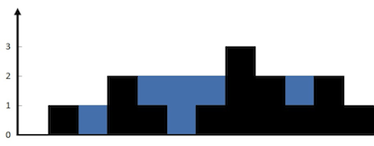

`Javascript`


> # Leetcode 42 - Trapping Rain Water

## Example 1



```var trap = function (height) {
    var Arr = height;
    var left = [];
    var right = [];
    var water = 0;
    left[0] = Arr[0];
    for (let i = 1; i < Arr.length; i++) {
        left[i] = Math.max(Arr[i], left[i - 1]);
    }
    right[Arr.length - 1] = Arr[Arr.length - 1];
    for (let j = Arr.length - 2; j >= 0; j--) {
        right[j] = Math.max(Arr[j], right[j + 1]);
    }
    for (let iter = 0; iter < Arr.length; iter++) {
        water = water + Math.min(left[iter], right[iter]) - Arr[iter];
    }
    return water;
};```